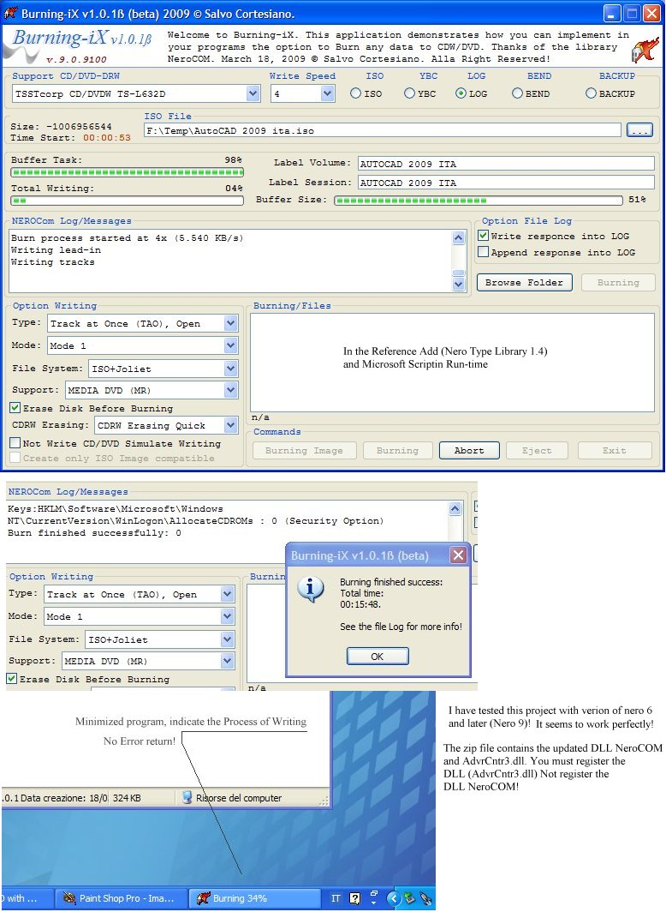



## Using the DLL NeroCOM to implement in our projects the Burning\!

### Description

This application demonstrates how you can implement in your programs the option to Burn any data to CDW/DVD thanks of the library NeroCOM. The file zip include the complete source code (see the screen-shot). The project also includes the related DLLs (updated). If you not found the DLL in the file zip, you can download them from this link: http://www.netshadows.it/BX-zip.

The Project create 4 folders (Backup) into path of the program (mybackup) and the related subFolders -&gt; (bend\Backup\ISO\LOG\YBC) &lt;-. I use this folders for my backup. Any files that is inside these folders will be Burned! The project also create a (*.nrg) File ISO (compatible with Nero) and (*.iso;*.cue) format from any folder you select. Burn also any File ISO and any selected folder! Suggestion and question are welcome. Happy coding!
 
### More Info
 

             |
---                |---
**Submitted On**   |2009-03-19 00:51:36
**By**             |[Salvo Cortesiano \(Italy\)](https://github.com/Planet-Source-Code/PSCIndex/blob/master/ByAuthor/salvo-cortesiano-italy.md)
**Level**          |Intermediate
**User Rating**    |5.0 (25 globes from 5 users)
**Compatibility**  |VB 6\.0
**Category**       |[Complete Applications](https://github.com/Planet-Source-Code/PSCIndex/blob/master/ByCategory/complete-applications__1-27.md)
**World**          |[Visual Basic](https://github.com/Planet-Source-Code/PSCIndex/blob/master/ByWorld/visual-basic.md)
**Archive File**   |[Using\_the\_2147253192009\.zip](https://github.com/Planet-Source-Code/salvo-cortesiano-italy-using-the-dll-nerocom-to-implement-in-our-projects-the-burning__1-71884/archive/master.zip)

